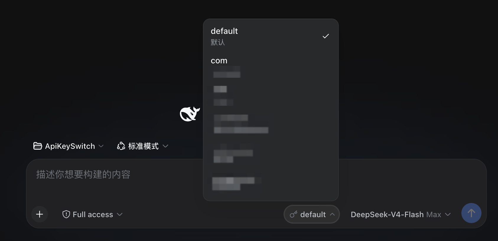
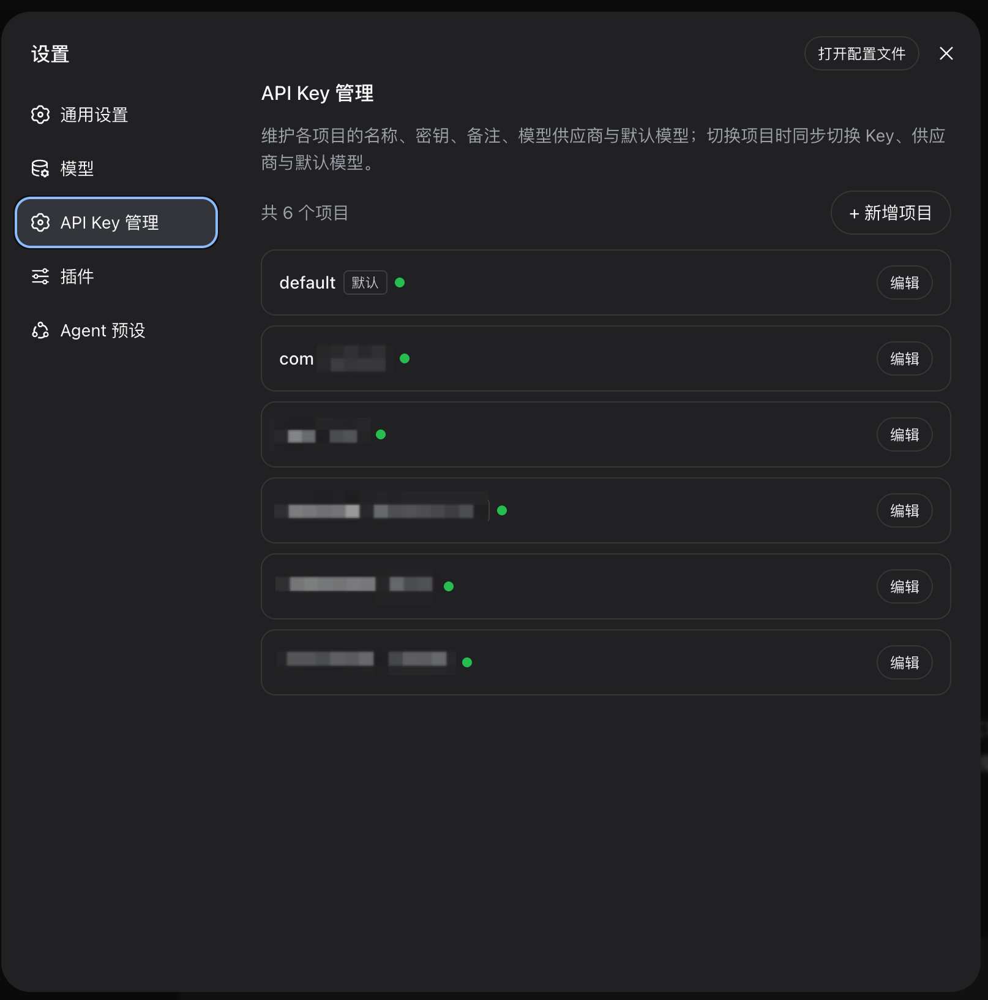

# ApiKeySwitch

DSH（DeepSeek Harness）Cordis 插件：按项目维护独立的 DeepSeek API Key，用户可手动切换当前生效的 Key，也可由工作目录自动切换；切换时同步模型供应商与默认模型。

## 项目简介

DSH 默认只为整个进程配置一把 API Key。本插件通过 DSH 的凭据接缝（`credentials` 服务 + `~/.dsh/.credentials.yaml`）为每个项目维护独立 Key，并提供三个切换入口：

- 作曲栏 Key 下拉框（模型切换框旁，外观对齐模型切换框）
- Run 卡片内切换面板（仅动态插件形态提供，部署形态为设置页 + 作曲栏 + 模型工具）
- 模型工具：`api_key_status` / `api_key_switch` / `api_key_set`

切换写入 `DEEPSEEK_API_KEY`（生效槽），模型提供商每次请求重新解析，立即生效、无需重启。切换时通过 `agentDefaultModel.saveSelection` 同步默认路由（供应商 + 模型）。手动切换成功后页面底部弹出「API Key 切换成功」Toast 提示（会话激活时的静默恢复不提示）。

**模型目录实时化**：模型供应商取自宿主 `llm.listProviders()` 与 `llm.listConfigurableProviders()`，模型取自对应 `settings` 命名空间的 `models` 数组（与「设置-模型」页同源），默认模型取自 `agentDefaultModel.currentSelection()`。插件内不存在模型 id 字面量，模型换代（如 `deepseek-v4-flash` 更新为 `deepseek-flash`）后自动跟随；项目配置里残留的失效模型不会写入默认路由，界面以「模型已更新」标签提示并在保存时写回。

**目录自动切换**：设置页「API Key 管理」每个项目可配置多个工作目录（`dirs`）。点击「+ 添加目录」直接打开系统目录选择框（macOS 为 Finder 选择框，与「添加工作区」同源），选中后生成一条记录：主行显示目录名，下方以小字显示完整路径，可「重选」或「移除」；重复目录会被拒绝并提示已在列表中。宿主未提供原生选择器（远程/SSH 部署）时退回手动填写绝对路径的输入框。切换 workspace（会话激活）时，插件按会话目录匹配绑定并自动切换到对应项目，作曲栏菜单同时显示「目录：<path> → <项目>」。约束：一个目录只能绑定一个项目，冲突保存会被拒绝并提示占用项目。目录绑定优先于会话记忆；命中但被守卫阻止时保留绑定，下次激活重试。

每个会话会记住自己最后选择的项目（localStorage，按会话隔离）：目录未命中绑定时会话激活自动恢复该会话的项目与 Key，不再串用上一个会话的 Key。

**切换守卫（防并发交叉污染）**：切换前宿主探测「是否有**其他**会话正在执行任务」（`agents` 服务中任意 agent 的 `status` 为 `running`，含子代理；调用者自身会话放行）。检测到其他会话运行中时，手动切换（作曲栏下拉框 / Run 卡片面板）、会话激活自动恢复、目录自动切换、模型工具 `api_key_switch` 一律拒绝并提示「请先停止运行中的会话后再切换」；守卫触发时 Toast 提示，会话记忆与目录绑定保留（下次激活且空闲时再重试）。原因：生效槽是进程级全局单槽，其他会话运行中的下一轮模型请求会立即使用新 Key 造成跨会话使用量交叉污染；守卫把"并发切换"的风险语义改为"先停止、再切换"。

内置项目仅 default（默认，受保护不可删除）；其他项目均在设置页「API Key 管理」中新增，每个项目独立维护 Key、备注、模型供应商、默认模型与工作目录。真实项目名称与凭据引用不入库。

## 技术栈

| 项 | 说明 |
| --- | --- |
| 宿主环境 | DSH 0.1.5-alpha.2（@deepseek-ai/dsh） |
| 插件版本 | 0.1.2（`package.json` 与 `plugin/manifest.json` 同步维护） |
| 插件形态 | Cordis 插件（Host + Client 双半区，Plain JavaScript）；部署形态为进程级插件包，动态形态为 `cordis_define` 会话级插件 |
| Host 接口 | `credentials`、`agentDefaultModel`、`llm`（listProviders / listConfigurableProviders / listModels）、`settings`（get）、`agents`、`workspaceRegistry`、`tools`（register）、`webServer`（register）；动态版为 `harness.defineTool / registerTool / handle` |
| Client 接口 | `slots`（settings.section / conversation.input.right / shell.overlay）、同源 `fetch` 调用 `/apikeyswitch/api`、`styles`、React（createElement） |
| 数据存储 | `~/.dsh/.credentials.yaml`（凭据接缝，热加载，权限 600） |

## 目录结构

```
ApiKeySwitch/
├── AGENTS.md            # AI 行为约束（Directive + Knowledge）
├── README.md            # 本项目索引
├── .gitignore
├── package.json         # 插件包清单（dsh.bundle.patch + dsh.client 声明）——仓库根目录即插件包
├── cordis.patch.yml     # bundle 补丁：安装后自动插入 apikeyswitch 插件行
├── lib/                 # 正式部署形态源码（进程级插件包，推荐）
│   ├── index.js         # Host 半区（ctx.tools.register + webServer 路由）
│   └── client.js        # Client 半区（模块加载器格式 + fetch RPC）
├── plugin/              # 动态插件形态源码（cordis_define 直接使用）
│   ├── manifest.json    # 插件元数据（内置项目、插槽、工具与 RPC 清单）
│   ├── host.js          # Host 半区源码（cordis_define 的 code.host 原文）
│   └── client.js        # Client 半区源码（cordis_define 的 code.client 原文）
└── docs/                # 项目文档
    └── ai_work/         # AI 工作记录
        ├── bugfix/      # 缺陷修复记录
        └── task/        # 需求与功能变更记录
```

## 模块说明

| 模块 | 文件 | 职责 |
| --- | --- | --- |
| Host 半区 | `plugin/host.js` | 凭据读写、项目目录（内置 + 自定义）管理、目录绑定与自动切换、备份与迁移、模型工具注册、Client RPC 处理器、路由同步 |
| Client 半区 | `plugin/client.js` | 设置页「API Key 管理」（复刻设置-模型页形态，折叠卡片 + 编辑展开 + 工作目录编辑）、作曲栏切换下拉框、Run 卡片切换面板 |

Host 内部函数一览：

| 函数 | 职责 |
| --- | --- |
| `catalog()` | 完整项目目录 = 内置项目（含元数据覆盖）+ 用户自定义项目，含各项目 `dirs` 绑定 |
| `collectStatus()` | 当前生效判定（引用值匹配，未匹配则为 default）+ 各项目配置状态 + 实时模型目录与默认路由 |
| `liveCatalog()` | 实时模型目录：`llm.listProviders()` + `llm.listConfigurableProviders()` + `settings.get(ns).models`（5 秒缓存） |
| `liveDefaultRoute()` / `effectiveRoute()` | 实时默认路由与有效路由解析（失效模型 id 回落，返回 `stale` 标记） |
| `switchProfile(id, opts)` | 切换 Key（备份/恢复 default）+ 同步默认路由；`opts.guard === false` 可显式关闭运行会话守卫（运维强制切换） |
| `autoSwitchByDir(args)` | 目录自动切换：会话目录 → 绑定项目 → 切换（受守卫约束） |
| `resolveSessionDir(sessionId)` | 会话当前目录：live 会话取 `agent.session.header.cwd`，历史会话取 `workspaceRegistry` 归属 |
| `resolveDirsArg()` / `findDirConflict()` / `sameDir()` / `canonDir()` | 目录绑定入参归一、唯一性校验与真实路径比对 |
| `guardRunning(opts)` / `collectRunningSessions()` | 运行会话守卫：探测 agents 服务中 status 为 running 的会话（排除调用者自身会话），命中则返回阻止结果（`ok:false` + `guard:true` + `running` 列表） |
| `syncRoute(profile)` | 通过 `agentDefaultModel.saveSelection` 写入供应商 + 模型（写入前按实时目录校正） |
| `saveProfile / addProfile / removeProfile` | 设置页增删改（删除仅限非 default；保存时校验目录唯一性） |
| `migrateLegacy()` | 旧版迁移：删除 DSH_PERSONAL_API_KEY，值转入备份槽 |

Host RPC（`POST /apikeyswitch/api`，动态版为 `harness.handle`）：

| action | 入参 | 说明 |
| --- | --- | --- |
| `status` / `list` | 无 | 生效项目、掩码 Key、项目清单（含 `dirs` / `model` / `modelStored` / `modelStale`）、实时模型目录、默认路由、运行中会话 |
| `catalog` / `models` | 无 | 实时模型目录（`providers` / `catalog` / `defaultRoute`） |
| `auto` | `{ sessionId }` | 按会话目录自动切换：未命中 `matched:false`，命中返回 `matched:true` + `dir` + `dirProfile` + 切换结果 |
| `pickDir` | 无 | 调用宿主 `directoryPicker.capability().pick()` 打开系统目录选择框：返回 `{ ok:true, cancelled, path }`；capability 非 native 时返回明确错误（界面按 capability 退回手填输入框） |
| `switch` | `{ profile, sessionId?, guard? }` | 切换生效 Key 并同步默认路由 |
| `set` | `{ profile, key }` | 仅保存某项目的 Key，不切换 |
| `save` | `{ id, remark, provider, model, dirs?, key?, renameTo? }` | 保存项目（`dirs` 存在时整体替换目录绑定） |
| `add` | `{ id, key, remark?, provider?, model?, dirs? }` | 新增项目 |
| `remove` | `{ id }` | 删除项目（default 不可删除） |

## 构建与运行

本项目无构建步骤（无 prepare 脚本，git 安装无需构建），源码以两种形态提供：

### 形态一：正式部署（仓库根目录即插件包，进程级，推荐）

**方式 A：官方安装命令**

仓库根目录是标准 DSH 插件包（`dsh.bundle.patch` + `dsh.client` 声明）。推送到 git 托管后，任何同事可执行：

```bash
dsh plugin --profile web add "https://github.com/BrandonLeaf/dsh-ApiKeySwitch#main"
```

流程：pnpm 安装仓库根目录为依赖 → `dsh plugin` 自动把声明了 `dsh.bundle` 的新依赖加入 `dsh.profile.bundles` → 启动时 bundle 补丁（`cordis.patch.yml`）自动插入插件行 → 插件挂载。无需手动编辑组合文件。安装后重启 `dsh web` 并刷新页面即可。

要求：机器装有 pnpm 且可访问 git 托管地址；`github:` 为 pnpm spec，GitLab/内网仓库可改用 `git+https://...` 或 `git+ssh://...`；建议用标签固定版本，标签格式为 `v<适配的 DSH 版本>-p-<插件版本>`，当前版本对应 `#v0.1.5-alpha.2-p-0.1.2`（已发布标签与版本变化见「版本对照」）。

**方式 B：手动复制（本地单机）**

1. 将 `lib/`、`package.json`、`cordis.patch.yml` 放入 `~/.dsh/profiles/web/node_modules/apikeyswitch/`；
2. 在 `~/.dsh/profiles/web/cordis.patch.yml` 追加挂载行：

```yaml
- insert:
    - id: apikeyswitch
      name: apikeyswitch
```

3. 重启 `dsh web` 进程（组合改动需要重启进程生效；profile 的 `patchReload: live` 只重放组合补丁，不会重新导入已缓存的插件模块），刷新页面后自动加载，无需手动运行。

与动态版的差异：模型工具改用 `ctx.tools.register`，Client 通信改用 webServer HTTP 路由（`POST /apikeyswitch/api`，action 分发），不注册 Run 卡片面板（`tool.view.cordis` 为动态插件专属插槽）。

### 形态二：动态插件（plugin/，会话级）

1. 在 DSH 会话中调用 `cordis_define`：
   - `plugin.kind: "new"`，`idPrefix: "apik"`
   - `code.host` 填入 `plugin/host.js` 内容
   - `code.client` 填入 `plugin/client.js` 内容
2. 调用 `cordis_run` 激活（Client 半区需在页面批准）。
3. 首次使用自动完成旧版迁移；在设置页「API Key 管理」配置各项目 Key。

限制：动态插件是会话级临时实体，页面刷新后需重新运行。

数据位置：

| 文件 | 说明 |
| --- | --- |
| `~/.dsh/.credentials.yaml` | 各项目 Key、备份槽、元数据 JSON（权限必须 600） |
| `~/.dsh/settings.yaml` | `agent-default-model` 默认路由与 `llm-deepseek` 模型目录（插件读取模型目录，切换时更新默认路由） |

### 版本对照

| 插件版本 | 适配 DSH 版本 | 标签 | 主要变化 |
| --- | --- | --- | --- |
| 0.1.2 | 0.1.5-alpha.2 | `v0.1.5-alpha.2-p-0.1.2` | 模型目录实时化（修复模型换代后仍关联旧模型）、工作目录自动切换、目录选择框 |
| 0.1.1 | 0.1.0-rc.8 | `v0.1.0-rc.8-p-0.1.1` | 切换守卫（防止多会话并发时 API Key 交叉污染） |
| 0.1.0 | 0.1.0-rc.8 | `v0.1.0-rc.8-p-0.1.0` | 首个版本：多项目 Key 管理、作曲栏切换、会话记忆 |

兼容性说明：0.1.1 及更早版本在 DSH 0.1.5-alpha.2 上模型下拉框为空（客户端 `connection.api` 已移除，`llm.providers` / `settings.describe` 不再可用），且会把失效模型 id 写入默认路由；升级到 0.1.5-alpha.2 必须使用 0.1.2 及以上版本。

### 升级到 DSH 0.1.5-alpha.2 的同步步骤

1. 将 `lib/` 与 `package.json` 复制到 `~/.dsh/profiles/web/node_modules/apikeyswitch/`（`plugin/` 为动态形态源码，不需要复制到该目录）；
2. 重启 `dsh web`（Host 半区为进程级模块，profile 的 `patchReload: live` 只重放组合补丁，不重新导入已缓存的 ESM 模块）；
3. 刷新页面，Client 半区随 `apikeyswitch/client.js` 重新加载；
4. 打开设置 ─► API Key 管理，确认模型下拉框显示当前模型目录中的模型（而非旧模型 id）。

## 文档索引

| 文档 | 用途 |
| --- | --- |
| `AGENTS.md` | AI 行为约束：密钥保护、源码约束、运行版本同步 |
| `README.md` | 本项目索引（本文件） |
| `docs/ai_work/bugfix/bugfix_2026-09-14_model-catalog-stale/` | 「API Key 管理关联旧模型」缺陷的问题分析、修复方案与修复报告 |
| `docs/ai_work/task/task_2026-09-14_dir-auto-switch/` | 「按工作目录自动切换 API Key」的需求、实现方案与实现报告 |

设计规范文档放 `docs/design/`，运维文档放 `docs/operations/`，源材料放 `docs/basis/`。

## 约束与注意事项

- 动态插件是进程内临时实体：进程重启后需重新加载，历史版本 Package 不可单独删除
- 切换对全局生效：所有会话共用一条模型路由
- 切换守卫基于 `agents` 服务运行状态：守卫检查与写入生效槽之间存在极小的竞态窗口（检查后、写入前会话可能起步），需要严格隔离时应为每个项目使用独立 DSH profile 或独立进程
- 会话记忆基于全局生效槽：目录未命中绑定时，切换会话的自动恢复会改写全局生效 Key；有会话正在执行任务时恢复被守卫阻止，需先停止运行中的任务
- 目录绑定优先于会话记忆：同一会话内手动切到其他项目后，再次激活该会话仍按目录绑定切回；需要固定使用某项目时应调整目录绑定
- 目录绑定依赖宿主目录归一能力：`workspaceRegistry.resolveByPath()` 在目录当前不存在时抛错并回落字符串比较，因此指向不存在目录的绑定不会命中任何会话
- 目录选择器仅在宿主 `directoryPicker.capability().kind === 'native'` 时使用（darwin/win32 且 loopback 绑定且非 SSH 启动）；远程/SSH/无显示会话下宿主挂载 browse 后端，插件按 capability 契约退回手填输入框，不渲染「+ 添加目录」的选择流程
- 系统目录选择框在 dsh 宿主机屏幕上弹出：宿主与浏览器不在同一台机器时无法使用，此时自动退回手填路径
- 运行时无每会话独立槽位：同一实例内两个会话并发执行时，Key 归属由请求发起瞬间的全局生效槽决定，守卫只能阻止"切换动作"，不能阻止"切完后新起步的请求"使用当前全局 Key
- 路由同步写入默认模型选择（写入前按实时模型目录校正，失效模型 id 不会落盘）；当前会话运行中的模型由作曲栏「模型切换框」主导
- 插件内不得出现供应商模型 id 字面量：模型目录与默认路由必须来自 `llm` / `settings` / `agentDefaultModel` 服务
- 当前部署的可用供应商为 `deepseek-official`（由 `@deepseek-ai/dsh-llm-deepseek` 适配器提供）；`@deepseek-ai/dsh-llm-pi-ai` 适配器虽随宿主组合挂载，但其声明的其余供应商路由未配置，插件按「未挂载且未配置」过滤，不出现在供应商下拉框中；需要启用其他供应商时，先在「设置-模型」中配置该供应商（或修改宿主组合 `~/.dsh/profiles/web/cordis.patch.yml`）并重启 Web 服务
- 文档与示例中不得出现真实 API Key，一律使用占位符（如 `sk-REPLACE_ME`）
- 本仓库为示例形态，真实项目名称、备注、工作目录与凭据引用不得写入仓库


## 效果图

以下截图取自 0.1.1 版界面（项目名称已打码），工作目录编辑区与目录记录为 0.1.2 新增，截图尚未更新。





